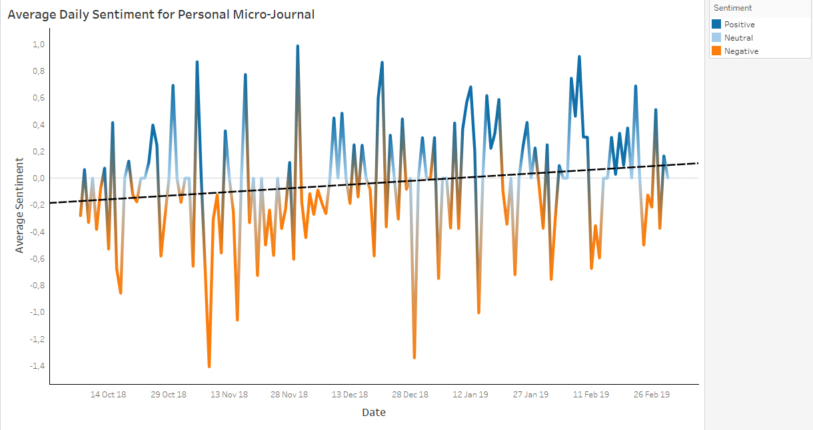

After using an app called [Daylio](https://daylio.webflow.io/) as a mood tracker and micro-journal for the past 5 months, I decided to explore the data using R for calculating the average sentiment of each journal entry and Tableau for data visualization.

## R Script
```{r}
library(magrittr)
library(syuzhet)
library(sentimentr)

# Get data from exported CSV file
myData <- read.csv("daylio_export.csv", stringsAsFactors = FALSE)

# Function to clean data 
clean.data <- function(doc) {
  doc <- gsub("#.*","",doc)
  doc <- gsub("@.*","",doc)
  doc <- gsub("[[:punct:]]", "", doc)
  doc <- iconv(doc, "UTF-8", "ASCII", sub = "")
  return(doc)
}

# Apply function
myData$note <- sapply(myData$note, clean.data)

# Convert all words to lower case
myData$note <- sapply(myData$note, tolower)

# Fix name of column 1
names(myData)[1] <- "full_date"

# Set full_date to Date Class
myData$full_date <- as.Date(myData$full_date, format = "%Y-%m-%d")
          
# Get sentiment score for each note
noteSentiment <- sentiment_by(myData$note) 

# Create dataframe with average sentiment score per note and its corresponding date
sentiment.df <- cbind.data.frame(
                                "sentiment" = noteSentiment$ave_sentiment,
                                "date" = myData$full_date)

# Write dataframe to new csv file 
write.csv(sentiment.df, file = "selfhelp.csv")

```

## Visualization 


## Final thoughts 
Although the results of this analysis on its own may not be enough to draw any meaningful conclusions, the trend that emerged was consistent with my experience of the past 5 months.

Getting a quantitative perspective on my journaling style was also really useful. I tend to use micro-journaling as a way to summarize my feeling towards a given day, and well - I suffer from depression and irritable bowel syndrome so my internal day to day experience can sometimes suck.

However, I am constantly looking for ways to improve my own quality of life and have to consider if practicing a more positive journaling style would be beneficial. Perhaps turning it into a daily practice of gratitude?
